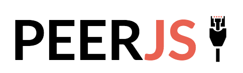

[참고](https://intrepidgeeks.com/tutorial/understand-the-concept-of-javascript-perjs)

## PeerJS는 무엇인가?

WebRTC를 활용하여 손쉽게 P2P간 실시간으로 text를 주고받거나
media stream connection을 만들 수 있게해주는 라이브러리로
WebRTC기술을 보다 편리하게 사용할 수 있다



## PeerJS세팅

<b>Include the Javascript client</b>

```typescript
<script src="https://unpkg.com/peerjs@1.3.2/dist/peerjs.min.js"></script>
```

<b>Create the Peer object (객체 생성)</b>

```typescript
let peer = new Peer();
```

## PeerJS 문법

peerjs객체는 생성될때 unique한 ID값이 할당된다

```typescript
peer.on("open", function (id) {
  console.log("My peer ID is: " + id);
});
```

## Method

<string>peer.on</string> - peer이벤트의 listeners를 세팅해줌 peer.on('open') - 커넥션이
연결된 경우 peer.on('connection') - 데이터를 받을 준비가된 상태 peer.on('disconnect')
- 원하지 않게 연결이 끊겼을때 peer.on('close') - 연결돼있는 커넥션을 끊어줌 peer.on('error')
- 연결중에 에러가 발생한 경우

peer.connect - peer.id값 으로 브라우저간 연결을 할 수 있다
peer.call - 미디어 커넥션할때 사용
peer.disconnect - 모든 커넥션 연결이 해제된 경우
peer.reconnect - 최근 서버에 연결된 peer ID값으로 재연결 시도
오직disconnected된 peer만 시도가능
peer.destroy - 커넥션 연결을 해제한다
peer.id - 다른 peer에 연결할 수 있는 ID값
peer.connections - 할당된 모든 커넥션에 접근가능
